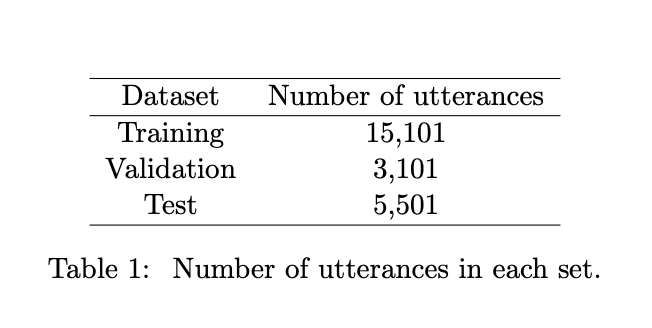
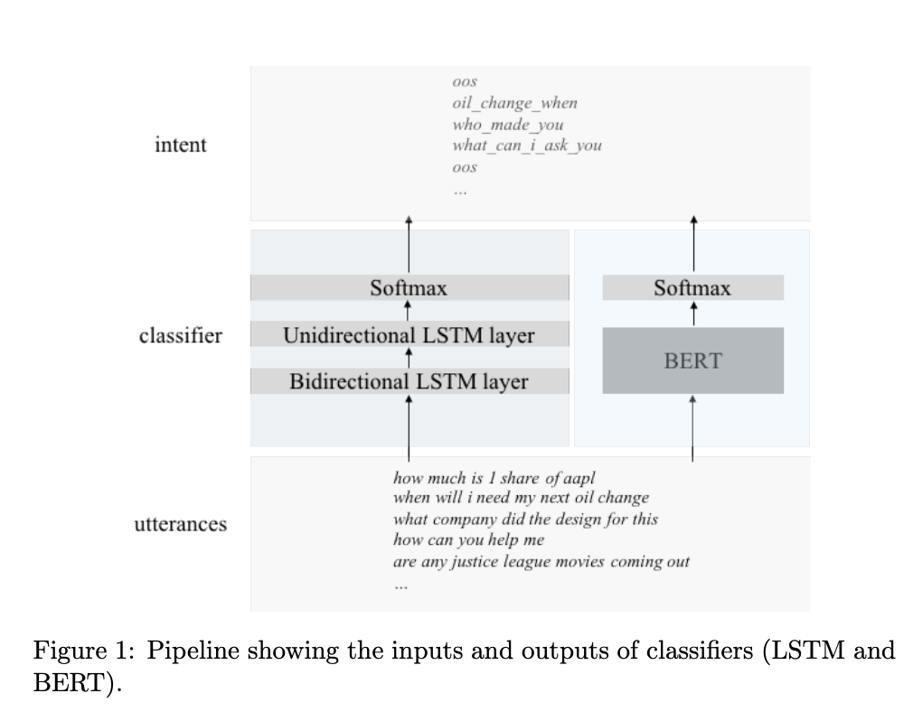
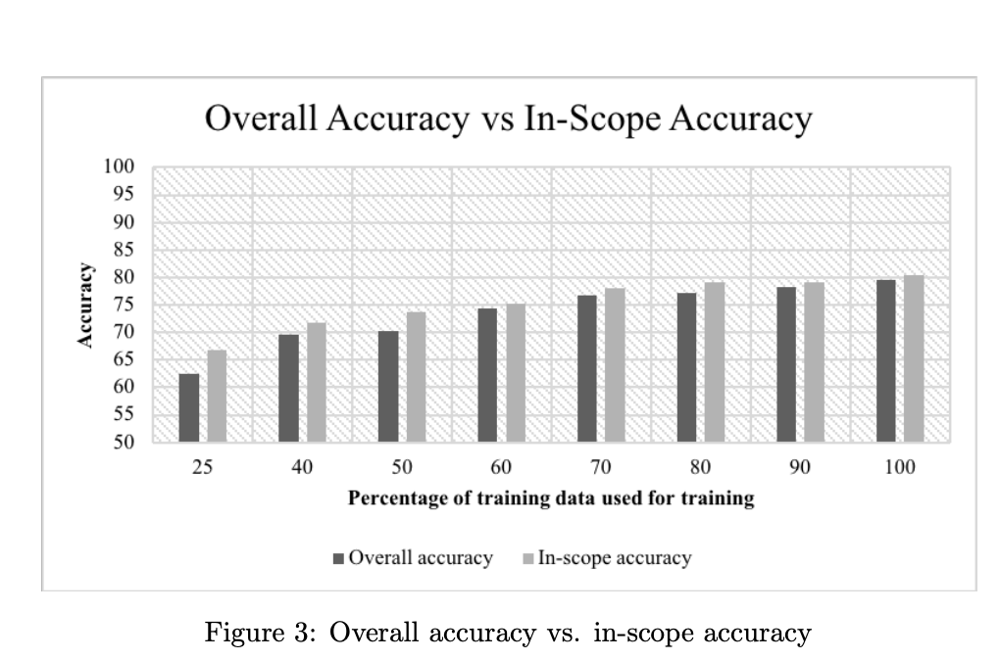
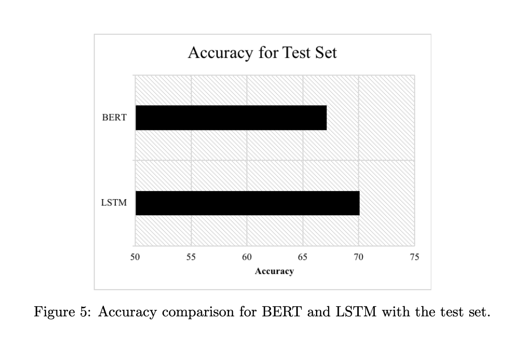
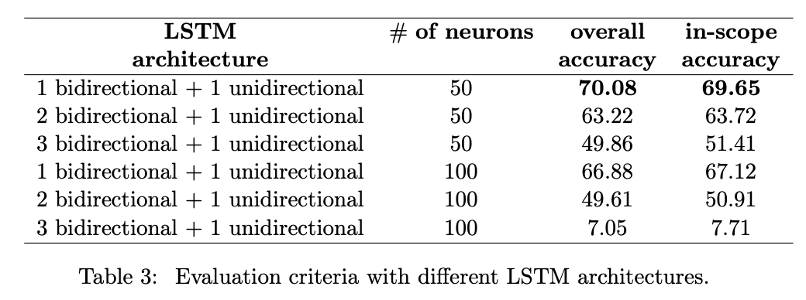
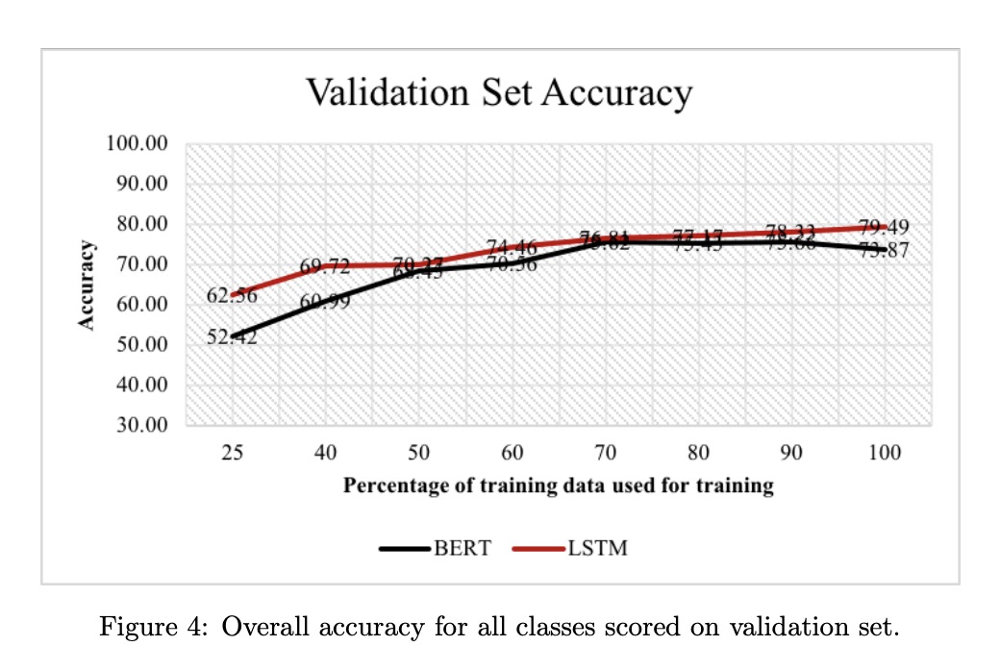

[A comparison of LSTM and BERT for small corpus](https://arxiv.org/pdf/2009.05451.pdf) 

#### 選んだ理由
kaggle コンペで参考にしたnoteにBERTの欠点が書かれていたので、どういった欠点があるのか調べたくなった
#### どんなもの
- 双方向のLSTMモデルと事前に訓練されたBERTモデルの性能を比較
- 結果、LSTMの方が高い結果を得ることができBERTのモデルチューニングよりも短時間で学習できた。
- 結論、モデルの性能はタスクとデータに依存するため、モデルを選択する前に、最も人気のあるモデルを直接選択するのではなく、これらの要因を考慮する必要がある

#### 研究課題は何
TransformerやBERT、転移学習を可能にしたNLPのImageNetモーメントは事前に訓練されたデータを調整するために大規模なデータセットを使用していた。
なので、課題を小さなデータセットに対してはどうなのかという現実社会でよくある課題に設定した。
TransormerとLSTMの小さなデータセットに対しての精度の比較をした論文がなかったので、自らそれを研究課題に設定。

#### 方法論
- チャットボットを構築するために収集された意図の分類のための小さなデータセットを使用

- タスク：テキスト分類
- 同じ訓練データセットで学習
- 同じ検証データセットとテストデータセットで評価
- データ集合のx%をランダムに取得
- LSTMとBERTのパイプラインの図

#### 技術や手法のキモはどこ？ 

#### どうやって有効だと検証した？
- テキスト形式の発言を受け取り、意図した返しを予測
- 目的は発言の意図をできる限り正確に予測すること
- LSTMモデルのニューロン数と双方向層を変えて有効性を検証
  - トータル６つのアーキテクチャを用意
  - 各LSTM層に50個のニューロンを配置した3つのLSTMモデルと
  - 各LSTM層に100個のニューロンを配置した3つのLSTMモデルで実験

#### 実験結果
- 全体的な精度とスコープナイな精度も報告
- データセットの異なるバージョンで両者を並べて下の図に示した
- スコープ内精度の方が全体精度より上がっている

- BERTとLSTMの比較では、総合精度のみを報告しています。（おそらく訓練精度はBERTが上)

- **モデルのパラメータ**
  - BERT
    - 学習率:2e-5
    - 埋め込みは独自のもの
  
  - LSTM
    - 学習率:0.01
    - optimizer: Adam
    - 埋め込みはGlove
  
- **LSTMアーキテクチャ**は下の図を使用

 
 - 最も単純なLSTMモデルが，全体的な精度（スコープ内の精度とスコープ外の精度の両方）とスコープ内の精度（スコープ外の発話を除去して精度を算出）の両方で最も高い性能を示した
  
- **使ったツール**
  - BERT
    - SAS Deep Learning を使用(SASについて調べる必要あり)
    - SASを使ってモデルをファインチューニング
    - 事前学習済みのHuggingFace repositoryのBert base uncasedを使用 
  - LSTM
    - スクラッチ

- **Validation Set**
  - どのアーキテクチャが最も優れているかに使用される
  - 検証データを使ってモデルの訓練や調整を行っていない
  - BERT と単純な LSTM アーキテクチャ（1 つの双方向層と 1 つの単方向層、各層に 50 個のニュー ロンを有する)
  - 異なるデータサイズ（使用した学習データの 25％から 100％まで）で比較した
  -  実験結果
    

  - LSTMは全てのデータ領域でBERTよりも優れていることがわかった
  - LSTMとBERTの精度の差はデータセットが大きい時より、小さい時の方が
大きな精度の差が見えた
  - データセットが小さい場合、LSTMのような単純なモデルの方が、BERTのような複雑なモデルよりも高い性能を発揮できることを示しています

- **Test Set**
  - Validation setでは最も単純なLSTMアーキテクチャーが良い精度を示したのでそれを採用
  - スコープ外の発言が多く含まれているため、精度が検証セットよりも低くなることが予想
  - リアルタイムシステムではシステムは見たことない発言に対処しなければならない
  - なのでテストセットには多く範囲外の発言が含まれている
- Test Setの結果
  - BERT モデルが 67.15％の精度を達成
  - LSTM モデルのスコア内精度は 69.65％, 総合精度は 70.08％
  - 図5は、BERTとLSTMの比較である。

#### 結論

LSTM は、焦点を当てた意図分類データなどの特定のデータセットにおいて、  
モデルの構築および調整にかかる時間が少なく、より高い精度を実現できることが示された
小さなデータセットに対しては検証データ、テストデータ両方でLSTMはBERTの精度を統計的に上回った

#### 自分が学べた知識
- 転移学習
  - 転移学習とは，あるタスクから別のタスクに知識を移すことで，学習データの収集やモデルの再構築にかかる労力を軽減するタスクである[11]．  
  - このタスクは，あるタスクで得た知識や経験を全く新しいタスクで再利用することで，精度の高い結果を得るために必要な全体の時間を短縮することができる
  - そのため、人工知能のコミュニティで大きく採用されている．

- 言語モデリング
  - 目的は、前の単語に基づいて次の単語を予測すること

- Transformerの斬新的な記録集
  - GloVe embeddingsがベクトル表現を提案. [Page:1532–1543](https://www.aclweb.org/anthology/D14-1.pdf)
  - だが、Embeddingを作成する際に文脈を考慮していない。つまりどこで使われてもその単語は同じベクトルになってしまう
  この限界を解決するために言語モデリングを目的とした学習された双方向LSTMを用いて単語埋め込みを作成する  
  文脈に基づく単語埋め込みのアイデアを考案[URL](https://www.aclweb.org/anthology/N18-1202.pdf)
  - BRETはマスキングされた言語モデリングを使用するため、ELMo および ULMFiT とは異なります
  - 次の単語を予測するだけ出なく、前の単語と次の単語の両方の文脈を考慮することで先行研究の限界に対処した
  - masked language modeling approachでは文中の単語をランダムに消去され特別なトークンに置き換え、
  - Transformerを使用してマスクされた単語を予測する
  - BERTは、GLUEベンチマーク[13]に示されているように、多くのNLPタスクにおいて記録的な結果を達成
  - RoBERTa[5]、DistillBERT[10]、OpenAI Transformer[8]、XLNet[14]などが斬新的な結果を出した

#### BERT
- BERTのアーキテクチャは転移学習に成功し、このアプローチにより、大規模なラベルなしデータセットを教師なしで学習し、モデルの最後の層を修正して特定のタスクに適応させることができる

[ELMO](https://arxiv.org/abs/1802.05365)

#### 思ったこと
この論文にも"モデルの性能はタスクとデータに依存するため、モデルを選択する前に、最も人気のあるモデルを直接選択するのではなく、これらの要因を考慮する必要がある"と
書かれていた通り、モデル選択をする際に考慮すべき要因について考える必要があることがわかった。
