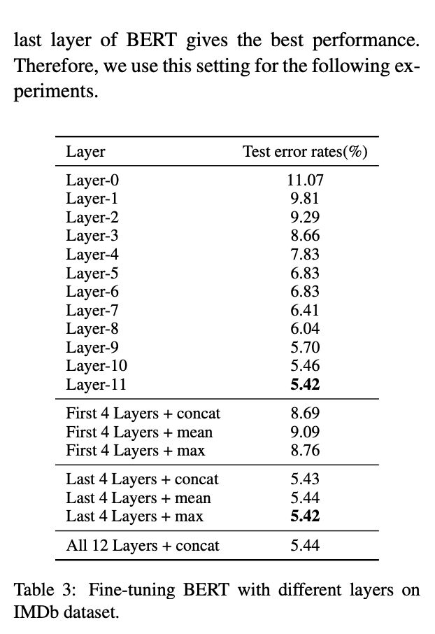

#### [How to Fine-Tune BERT for Text Classification?](https://arxiv.org/pdf/1905.05583v3.pdf)

#### 選んだ理由
BERTのチューニング方法について知りたかった
#### どんなもの
- BERTモデルのfine-tuningを行いBERTの可能性を探る

#### 研究課題
- テキスト分類におけるBERTの性能の向上が目的
- BERTの様々なfine-tuningを網羅的な実験で検証
- それにより、テキスト分類に対するBERTの利用の最大化

#### fine-tuning方法
- 事前学習されたBERTモデルのfine-tuningを行うための３段階
  1. タスク内訓練データまたはドメイン内データ上で BERT をさらに事前訓練する
  2. 複数の関連タスクが利用可能な場合、マルチタスク学習を用いて BERT を任意にfine-tuning
  3. 目標タスク用にfine-tuning

#### 実験結果
1. BERTの最上層はテキスト分類に有効
2. 適切な層ごとに学習率を低下させることでBERTは、Catastrophic Forgettingを克服することができる
3. タスク内およびドメイン内のさらなる事前訓練により、その性能を大幅に向上させることができる

#### BERT-base Model
  - 12個のTransormers
  - 12 self-attention
  - 768の隠れ層をもつエンコーダ
- 512トークン以下のシーケンスを入力としそのシーケンスの表現を出力
- シーケンスには１つか２つのセグメントが用意されており([CLS], [SEP])
- テキスト分類作業のために、BERT は、最初のトークン [CLS] の最終的な隠れた状態 h を、シーケンス全体の表現とする。  
- 単純なソフトマックス関数をBERTの先頭に追加

- Wはタスク固有のパラメータ行列
- 対数確率の最大化によりBERTとWのパラメータのfine-tuningを共同で行う

#### BERTを対象タスクに適応させるには

1. 最大長配列が512なので長文の前処理
2. 層の選択
公式のBERT-base
    - 埋め込み層, 12層のエンコーダ, プーリング層で構成されている
    - テキスト分類に最も適した層を選択する必要がある
3. オーバーフィッティング
  - 適切な学習率をもつoptimizerを選択する必要がある

#### 実験結果3をどう検証したか
##### 事前訓練を上乗せ
- BERTは一般的なドメインで事前訓練されている。
- そうなると、特定のドメインには対応していない。
- データ分布が違うので特定のドメインがもつデータ分布に対応される必要がある

##### 事前訓練アプローチ
1. タスク内事前訓練
  - BERTが対象タスクの訓練データ上でさらに事前学習させる
2. ドメイン内事前訓練
  - 事前訓練データが対象タスクの同じドメインから取得される
  - 例えば類似したデータ分布をもつ複数の異なる感情タスクが存在する
  - これらのタスクから選択し、訓練データを用いてさらに事前学習させる
3. クロスドメイン事前訓練
  - 事前訓練データが、対象タスクと同じドメインと他の異なるドメインの 両方から取得される

#### Experiments
##### Datasets
- 各データセットの8つの統計情報
- IMDb：映画
- Yelp: 料理

##### Hyperparameter
<事前学習>
- hidden size: 768
- Transformer: 12
- self-attention-head: 12
- BS: 32
- 最大の文章の長さ: 128
- 学習率: 5e-5
- トレーニングステップ: 100,000
- warm-up steps : 10,000
- Dropout:常に0.1
- Adam: β1=0.9, β2=0.999
- 傾斜三角学習率を使用: [URL](https://arxiv.org/abs/1801.06146)

##### Exp-I: Investigating Different Fine-Tuning Strategies
##### Long Textをどう処理するか
- Truncation method(切り詰め手法)
  - 記事のキーとなる情報は最初と最後にある前提で文章を切り詰める
つめ方:
1. head-only: 最初の510token
2. tail-only: 最後の510token
3. head+tailonly:最初の128と最後の382
##### Hierarchical methods
- k個のテキスト表現が得られる
- 各フラクション: 最後の層は the hidden state of the [CLS] tokens  

#####  Features from Different layers
- 各層は入力テキストの様々な特徴を捉える
- 異なる層の特徴の有効性を調査
- 下の図は異なる層を用いて BERT をfine-tuningした場合の性能

#####  Catastrophic Forgetting
- Catastrophic Forgettingは転移学習の一般的な問題
- 新しい知識の学習中に事前に訓練された知識が消去されることを意味する
- BERTがこの問題に悩まされているか学習率を変えて調査
- 下のFigure2

- グラフからわかることは低い学習率2e-5の時がCF問題を克服した
- 逆に4e-4のときは収束に失敗している

##### Layer-wise Decreasing Layer Rate
- 異なる学習率とdecay factorを試しtest errorを測った

##### Exp-II: Investigating the Further Pretraining
- 教師あり学習でBERT fine-tuningに加えて、教師なしのマスクされた言語モデルと次の文の予測タスクによって、訓練データ上でBERTでさらに訓練する

#####  Within-Task Further Pre-Training
- タスク内でのさらなる事前学習の有効性を調べる
- 異なるステップでさらに事前学習したモデルを、テキスト分類タスクでfine-tuning
下のグラフからわかったこと
- 対象タスクに対する BERT の性能を向上させるには、さらなる事前学習が有効
- 100kの学習ステップ後に最高の性能を達成

##### In-Domain and Cross-Domain Further Pre-Training
ドメイン内データおよびクロスドメインデータを用いて BERT をさらに事前訓練することで、BERT の性能を引き続き向上させることができるかどうかを調査
- 対象のタスクの他に同じドメインのデータで, さらにBERTを事前訓練させる
- 7つの英語データセットをトピック、センチメント、および質問の3つのドメインに分割
- 分割方法は正しくないので、各タスクを別のドメインとして設定し、
クラスタスクの事前訓練のための実験を行う
下の表に示す

**Table5の解説**

- ほとんど全ての事前学習モデルが7つのデータセットでBERTbaseモデルより良い性能を示している(tableの「w/o pretrain」がBERTbaseモデル)
- ドメイン内での事前学習はタスク内での事前学習よりも優れた性能を示した
- allはクロスドメイン事前訓練
クロスドメインの事前訓練は明らかな利点があるとは言えない。  
sentimentドメインでは互いに役に立っていない  
この理由はなんとなくイメージできる。  
なぜならIMDbは映画でYelpは料理なので、データの分布が全く違うことから納得できる

#####  Comparisons to Previous Models
- [Char-level CNN(page649~657)](https://papers.nips.cc/paper/2015/file/250cf8b51c773f3f8dc8b4be867a9a02-Paper.pdf)
- [VDCNN ](https://arxiv.org/pdf/1606.01781.pdf)
- [DPCNN(page562~)](https://riejohnson.com/paper/dpcnn-acl17.pdf)
- [D-LSTM](https://arxiv.org/pdf/1703.01898.pdf)
- [Skim-LSTM](https://arxiv.org/pdf/1711.02085.pdf)
- [Hierarchical Attention Networks for Document Classification](https://www.cs.cmu.edu/~./hovy/papers/16HLT-hierarchical-attention-networks.pdf)
- [A NEW METHOD OF REGION EMBEDDING FOR TEXTCLASSIFICATION](https://openreview.net/pdf/aa0bc6d2b33199a5dc3aba019adbc0440fbeecc6.pdf)
- [Learned in Translation: Contextualized Word Vectors](https://arxiv.org/pdf/1708.00107.pdf)
- [ULMFiT ](https://arxiv.org/pdf/1801.06146.pdf)
- [BiLSTM](https://arxiv.org/pdf/1703.03130.pdf)
- BERT-FeatはBERTモデルからの特徴量をbiLSTMの入力として使用
- BERT-IDPT-FiTの結果は、表5の「all sentiment」、「all question」、「all topic」の行に対応、
- BERT-CDPTFiTの結果は、その中の「all」の行に対応する
- 下の図はBERT-FiT は、ULMFiT を除くすべてのベースラインよりも優れた性能を示している
- BERT-IDPT-FiT は、平均エラー率が 18.57％減少し、最も優れた性能を示した。

##### Exp-III: Multi-task Fine-Tuning

#### reference
- ニューラルネットワークの異なる層は、異なるレベルの構文情報と意味情報を捉えること
  - [URL](https://papers.nips.cc/paper/2014/file/375c71349b295fbe2dcdca9206f20a06-Paper.pdf)
[code1](https://github.com/xuyige/BERT4doc-Classification)
[code2](https://github.com/uzaymacar/comparatively-finetuning-bert)
[ELMO](https://arxiv.org/abs/1802.05365)
